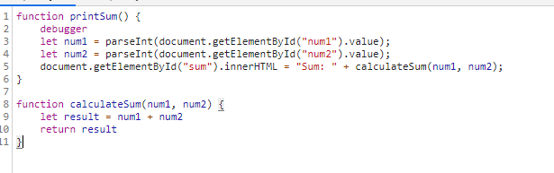

# Part 3. Debugging using the DevTools

## Answers
1. The bug is that the values of num1 and num2 are stored as strings so when they are added it adds together the strings instead of using integer addition.
2. Turn num1 and num2 into integers before passing them to calculateSum.
   
3. citylots.json
4. part2.js
5. 11.7 MB
6. 1.71 s
7. Mozilla/5.0 (Windows NT 10.0; Win64; x64) AppleWebKit/537.36 (KHTML, like Gecko) Chrome/90.0.4430.85 Safari/537.36
8. Apache
9. Tue, 26 Jan 2021 22:14:13 GMT
10. application/json
11. fetchData()